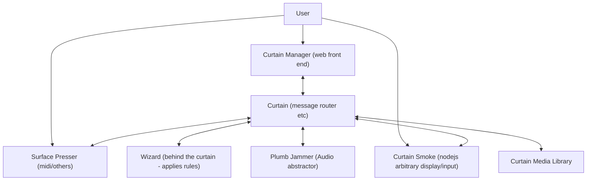

Design

Grouping and hinting.
Group - i.e. host, room/location, super group i.e. house. 
There's a default group, but you can add more.
Controllers should be assigned to a group - eg, 'house' or 'desktop' - this can also be a list in order of preference. this will mean it hints to the last active source in order.

Curtain Entities
Entities are 'things' - they can have sub entities. EG: A soundcard with 6 channels is an Entity, that entity has volume as an attribute, and it has 6 sub-entity channels. The channels would not typically be interacted with. Sub Entites are things that are inherent to the Super Entity - if they are not, then it is a linked Entity. 
Entities can be limited to connections within a group (eg: an application media source on a PC cannot link to a sink outside the PC, only through an intermediary. The same goes for a Sound Interface - The VBAN interface associated with it can be linked, but the sound interface cannot.) 

* Controllable Media (i.e. music or video)
* Media Source (i.e. you can't control it but you can see what it is, like Compy486.exe)
* Sound device 
* Groups - groups have types. (rooms, devices, 

Displays:
* Indicator - one light indicating a value.
* 7 segment - classic LCD style
* Text - i.e. scribble strips on a midi controller. 
* Embedded - addressable pixel grid, but on an embedded device so needs that setup. may be monochrome.
* Full - full capable display, can run node display module.

Display attributes:
* width*
* height*
* Physical size
* Touchscreen (devices which are touchscreens will hint to the display generator to allow for touch friendly display. The physical size will also help here)
* color (This is RGB, monochrome, a colour string describing the display (i.e. cyan), or a list of colours possible on the display.
* invert Some screens can invert
* CharacterSet Acceptible characters for the display (applies to text)

Displays can be hinted into multiple subdisplays, including overlapping (eg: Media display overlays channel status, but has a timeout so only shows on change)
Canvas goes on a display and is arbitrary size. It inherits all the values and options of the display. 
Canvas specific attributes:
* size

TextCanvas goes on a Canvas and is arbitrary size. It inherits all the values and options of the display. 
Canvas specific attributes:
* size
* largebehaviour: rotate, cycle, shorten, cut

Style:
This sets what things actually look like. It takes the type of the display, the size of the display, the hints of what the display (or sub display) wants, the data available in the entity(ies), if it's a touch screen, and builds a UI. 
A style is written in javacript using node.js It should request *all* images and widgets from the librarian (so you would typically have a style specific library - but this allows people to change style elements without changing code)
A style can have arbitrary configuration - this is sent with the style to the device.
A style does not HAVE to handle types of displays other than full, but it may.
A style should not do anything in terms of calculation, this should be from an attribute where at all possible.

Librarian. The wizard handles the routing. The librarian handles all the media.

Theme:
adjusts the style of widgets, hints the default font, colours, colour sets, button styles. themes can apply to different display types.

image libraries:

image libraries provide logos and icons, as well as UI bits and pieces. They are configured in order, and are searched by plain string, hinted by type. When requested they are requested by size, so a correctly styled icon can be provided.
Image libraries can be dynamic - eg, a movie poster. It may return a placeholder (or related image) before fetching and sending the specific image. In these cases it needs to indicate a replacement is expected. Images are stored and cached by smoke
eg:
companylogos
johnsdevices
devices
Clients can also provide their own image libraries. By default, these are top of the list for entites that are associated with that client.

types:
* logo
* icon
* background
* picture
* element (for UI etc)
* media:
 * song
 * album
 * artist
 * movie
 * actor
 

Smoke Show (display outputs):
 Display output for full capability displays is done using node-canvas. This means there's an ability to run it on many many devices, as well as on a web broswer either semi-permanently or just for testing. 
 

https://github.com/wbkd/awesome-node-based-uis
